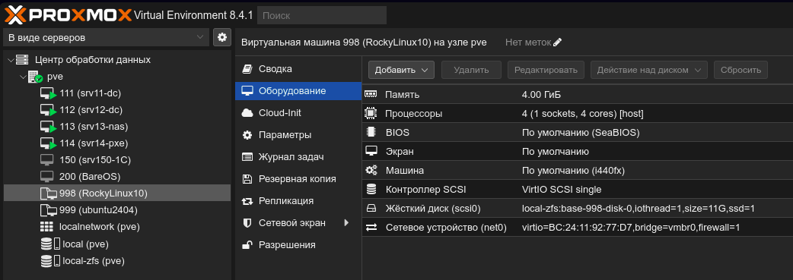
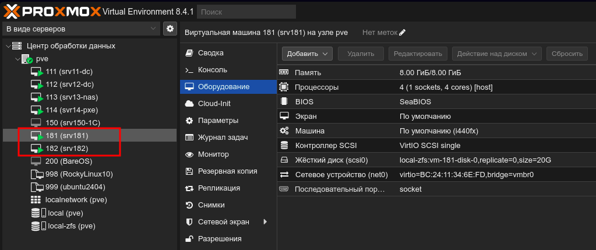
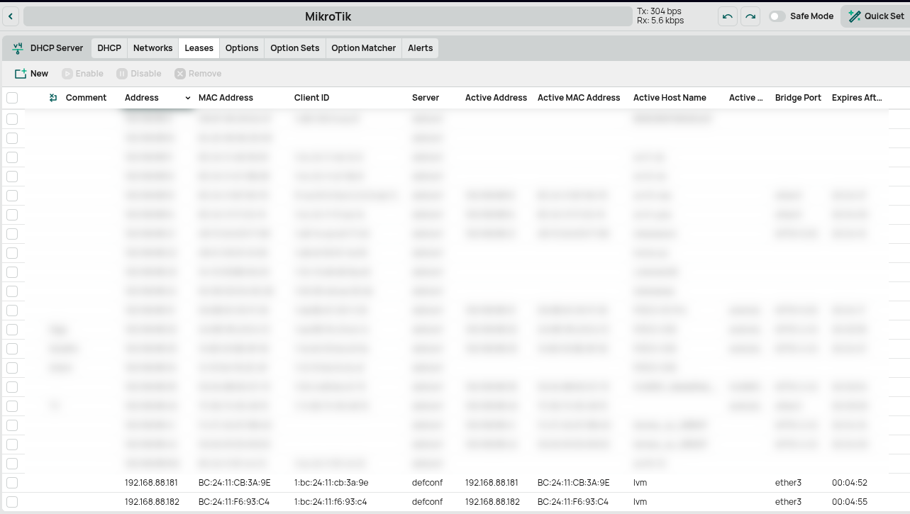
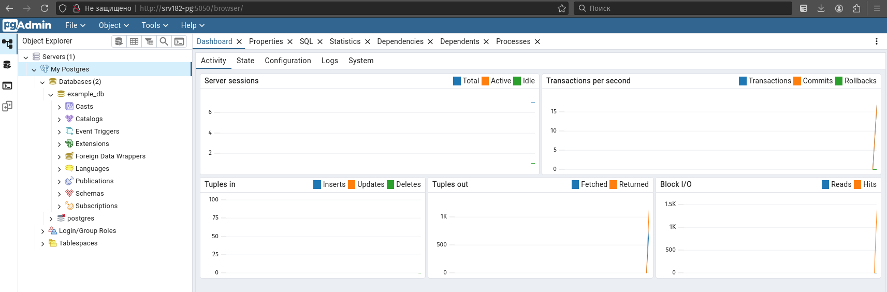

# Стажировка в Webbee
# Тестовое задание для DevOps

## Требования к выполнению
1. Использовать любую систему виртуализации (VirtualBox, VMware и т.д.)
2. Для развертывания сервисов использовать Docker Compose
3. Все конфигурационные файлы должны быть предоставлены в репозитории

## Задание

### Часть 1: Настройка инфраструктуры

1. Поднять 2 виртуальные машины (условно ВМ1 и ВМ2)
2. Настроить сетевую видимость между машинами и между ВМ1 и хостом (вашим пк)

### Решение Части 1: Настройка инфраструктуры

1. Поднять 2 виртуальные машины (условно ВМ1 и ВМ2)

Для выполнения тестового задания буду использовать домашним сервер с Proxmox. На сервере был создан шаблон виртуальной машины с Rocky Linux 10



На ноутбуке с ОС Pop OS 22.04 был установлен opentofu

```bash
╰─➤tofu --version
OpenTofu v1.9.1
on linux_amd64
```

Пишу код для создание виртуальных машин, который находится по ссылке [OpenTofu](opentofu/)

Инициализирую проект

```bash
╰─➤tofu init

Initializing the backend...

Initializing provider plugins...
- Finding registry.terraform.io/telmate/proxmox versions matching "3.0.2-rc01"...
- Installing registry.terraform.io/telmate/proxmox v3.0.2-rc01...
- Installed registry.terraform.io/telmate/proxmox v3.0.2-rc01 (unauthenticated)

OpenTofu has created a lock file .terraform.lock.hcl to record the provider
selections it made above. Include this file in your version control repository
so that OpenTofu can guarantee to make the same selections by default when
you run "tofu init" in the future.

╷
│ Warning: Incomplete lock file information for providers
│ 
│ Due to your customized provider installation methods, OpenTofu was forced to calculate lock file checksums locally for the following providers:
│   - registry.terraform.io/telmate/proxmox
│ 
│ The current .terraform.lock.hcl file only includes checksums for linux_amd64, so OpenTofu running on another platform will fail to install these
│ providers.
│ 
│ To calculate additional checksums for another platform, run:
│   tofu providers lock -platform=linux_amd64
│ (where linux_amd64 is the platform to generate)
╵

OpenTofu has been successfully initialized!

You may now begin working with OpenTofu. Try running "tofu plan" to see
any changes that are required for your infrastructure. All OpenTofu commands
should now work.

If you ever set or change modules or backend configuration for OpenTofu,
rerun this command to reinitialize your working directory. If you forget, other
commands will detect it and remind you to do so if necessary.
```

Проверяю

```bash
╰─➤tofu validate
Success! The configuration is valid.
```


```bash
╰─➤tofu plan

OpenTofu used the selected providers to generate the following execution plan. Resource actions are indicated with the following symbols:
  + create

OpenTofu will perform the following actions:

  # proxmox_vm_qemu.srv-docker[0] will be created
  + resource "proxmox_vm_qemu" "srv-docker" {
      + additional_wait        = 5
      + agent                  = 1
      + agent_timeout          = 90
      + automatic_reboot       = true
      + balloon                = 8192
      + bios                   = "seabios"
      + boot                   = "order=scsi0"
      + bootdisk               = (known after apply)
      + cipassword             = (sensitive value)
      + ciupgrade              = true
      + ciuser                 = "pve"
      + clone                  = "RockyLinux10"
      + clone_wait             = 10
      + current_node           = (known after apply)
      + default_ipv4_address   = (known after apply)
      + default_ipv6_address   = (known after apply)
      + define_connection_info = true
      + desc                   = "Managed by Terraform."
      + force_create           = false
      + full_clone             = true
      + hotplug                = "network,disk,usb"
      + id                     = (known after apply)
      + kvm                    = true
      + linked_vmid            = (known after apply)
      + memory                 = 8192
      + name                   = "srv181"
      + onboot                 = false
      + protection             = false
      + reboot_required        = (known after apply)
      + scsihw                 = "virtio-scsi-single"
      + skip_ipv4              = false
      + skip_ipv6              = true
      + ssh_host               = (known after apply)
      + ssh_port               = (known after apply)
      + tablet                 = true
      + tags                   = (known after apply)
      + target_node            = "pve"
      + unused_disk            = (known after apply)
      + vm_state               = "running"
      + vmid                   = 181

      + cpu {
          + cores   = 4
          + limit   = 0
          + numa    = false
          + sockets = 1
          + type    = "host"
          + units   = 0
          + vcores  = 0
        }

      + disks {
          + scsi {
              + scsi0 {
                  + disk {
                      + backup               = true
                      + format               = "raw"
                      + id                   = (known after apply)
                      + iops_r_burst         = 0
                      + iops_r_burst_length  = 0
                      + iops_r_concurrent    = 0
                      + iops_wr_burst        = 0
                      + iops_wr_burst_length = 0
                      + iops_wr_concurrent   = 0
                      + linked_disk_id ```bash
╰─➤tofu validate
Success! The configuration is valid.
```      = (known after apply)
                      + mbps_r_burst         = 0
                      + mbps_r_concurrent    = 0
                      + mbps_wr_burst        = 0
                      + mbps_wr_concurrent   = 0
                      + size                 = "20G"
                      + storage              = "local-zfs"
                    }
                }
            }
        }

      + network {
          + bridge    = "vmbr0"
          + firewall  = false
          + id        = 0
          + link_down = false
          + macaddr   = (known after apply)
          + model     = "virtio"
        }

      + serial {
          + id   = 0
          + type = "socket"
        }

      + smbios (known after apply)
    }

  # proxmox_vm_qemu.srv-docker[1] will be created
  + resource "proxmox_vm_qemu" "srv-docker" {
      + additional_wait        = 5
      + agent                  = 1
      + agent_timeout          = 90
      + automatic_reboot       = true
      + balloon                = 8192
      + bios                   = "seabios"
      + boot                   = "order=scsi0"
      + bootdisk               = (known after apply)
      + cipassword             = (sensitive value)
      + ciupgrade              = true
      + ciuser                 = "pve"
      + clone                  = "RockyLinux10"
      + clone_wait             = 10
      + current_node           = (known after apply)
      + default_ipv4_address   = (known after apply)
      + default_ipv6_address   = (known after apply)
      + define_connection_info = true
      + desc                   = "Managed by Terraform."
      + force_create           = false
      + full_clone             = true
      + hotplug                = "network,disk,usb"
      + id                     = (known after apply)
      + kvm                    = true
      + linked_vmid            = (known after apply)
      + memory                 = 8192
      + name                   = "srv182"
      + onboot                 = false
      + protection             = false
      + reboot_required        = (known after apply)
      + scsihw                 = "virtio-scsi-single"
      + skip_ipv4              = false
      + skip_ipv6              = true
      + ssh_host               = (known after apply)
      + ssh_port               = (known after apply)
      + tablet                 = true
      + tags                   = (known after apply)
      + target_node            = "pve"
      + unused_disk            = (known after apply)
      + vm_state               = "running"
      + vmid                   = 182

      + cpu {
          + cores   = 4
          + limit   = 0
          + numa    = false
          + sockets = 1
          + type    = "host"
          + units   = 0
          + vcores  = 0
        }

      + disks {
          + scsi {
              + scsi0 {
                  + disk {
                      + backup               = true
                      + format               = "raw"
                      + id                   = (known after apply)
                      + iops_r_burst         = 0
                      + iops_r_burst_length  = 0
                      + iops_r_concurrent    = 0
                      + iops_wr_burst        = 0
                      + iops_wr_burst_length = 0
                      + iops_wr_concurrent   = 0
                      + linked_disk_id       = (known after apply)
                      + mbps_r_burst         = 0
                      + mbps_r_concurrent    = 0
                      + mbps_wr_burst        = 0
                      + mbps_wr_concurrent   = 0
                      + size                 = "20G"
                      + storage              = "local-zfs"
                    }
                }
            }
        }

      + network {
          + bridge    = "vmbr0"
          + firewall  = false
          + id        = 0
          + link_down = false
          + macaddr   = (known after apply)
          + model     = "virtio"
        }

      + serial {
          + id   = 0
          + type = "socket"
        }

      + smbios (known after apply)
    }

Plan: 2 to add, 0 to change, 0 to destroy.

───────────────────────────────────────────────────────────────────────────────────────────────────────────────────────────────────────────────────────────

Note: You didn't use the -out option to save this plan, so OpenTofu can't guarantee to take exactly these actions if you run "tofu apply" now.
```

Валидация прошла успешно и никаких ошибок выявлено не было, применю конфигурацию с помощью команды `tofu apply`

```bash
╰─➤tofu apply

OpenTofu used the selected providers to generate the following execution plan. Resource actions are indicated with the following symbols:
  + create

OpenTofu will perform the following actions:

...

  Enter a value: yes

proxmox_vm_qemu.srv-docker[1]: Creating...
proxmox_vm_qemu.srv-docker[0]: Creating...
proxmox_vm_qemu.srv-docker[0]: Still creating... [10s elapsed]
proxmox_vm_qemu.srv-docker[1]: Still creating... [10s elapsed]
proxmox_vm_qemu.srv-docker[1]: Still creating... [20s elapsed]
proxmox_vm_qemu.srv-docker[0]: Still creating... [20s elapsed]
proxmox_vm_qemu.srv-docker[0]: Still creating... [30s elapsed]
proxmox_vm_qemu.srv-docker[1]: Still creating... [30s elapsed]
proxmox_vm_qemu.srv-docker[0]: Still creating... [40s elapsed]
proxmox_vm_qemu.srv-docker[1]: Still creating... [40s elapsed]
proxmox_vm_qemu.srv-docker[1]: Creation complete after 42s [id=pve/qemu/182]
proxmox_vm_qemu.srv-docker[0]: Still creating... [50s elapsed]
proxmox_vm_qemu.srv-docker[0]: Still creating... [1m0s elapsed]
proxmox_vm_qemu.srv-docker[0]: Still creating... [1m10s elapsed]
proxmox_vm_qemu.srv-docker[0]: Still creating... [1m20s elapsed]
proxmox_vm_qemu.srv-docker[0]: Creation complete after 1m23s [id=pve/qemu/181]

Apply complete! Resources: 2 added, 0 changed, 0 destroyed.
```

Результатом успешного выполнения этой команды будет создание 2-ух виртуальных машин.



2. Настроить сетевую видимость между машинами и между ВМ1 и хостом (вашим пк)

На уровне роутера присвою статические ареса для ВМ



Можно было присвоить статический адрес на самой ВМ командой:

```bash
╰─➤sudo nmcli connection modify ens18 ipv4.method manual ipv4.address 192.168.88.181/24 ipv4.gateway 192.168.88.1 ipv4.dns 192.168.88.1
```

Подсоединюсь к одной из виртуальных машин по `ssh`, поменяю ей имя, и изменю файл `/etc/hosts` для настройки сетевой видимости по доменному имени.

```bash
╰─➤ssh admn@192.168.88.181[OpenTofu](opentofu/)
admn@192.168.88.181's password: 
Web console: https://lvm:9090/ or https://192.168.88.181:9090/

Last login: Sun Jun 22 14:02:29 2025 from 192.168.88.21

╰─➤sudo hostnamectl set-hostname srv181-nginx

╰─➤hostnamectl 
     Static hostname: srv181-nginx
           Icon name: computer-vm
             Chassis: vm 🖴
          Machine ID: defb6a0cb1c745c4b5cc593f99cfa1cc
             Boot ID: 6ef350e9e70141ecaea7ca8016230115
      Virtualization: kvm
    Operating System: Rocky Linux 10.0 (Red Quartz)               
         CPE OS Name: cpe:/o:rocky:rocky:10::baseos
      OS Support End: Thu 2035-05-31
OS Support Remaining: 9y 11month 1w                               
              Kernel: Linux 6.12.0-55.14.1.el10_0.x86_64
        Architecture: x86-64
     Hardware Vendor: QEMU
      Hardware Model: Standard PC _i440FX + PIIX, 1996_
    Firmware Version: rel-1.16.3-0-ga6ed6b701f0a-prebuilt.qemu.org
       Firmware Date: Tue 2014-04-01
        Firmware Age: 11y 2month 3w

╰─➤echo "192.168.88.181 srv181-nginx" | sudo tee -a /etc/hosts
192.168.88.181 srv181-nginx

╰─➤echo "192.168.88.182 srv182-pg" | sudo tee -a /etc/hosts
192.168.88.182 srv182-pg

╰─➤cat /etc/hosts
# Loopback entries; do not change.
# For historical reasons, localhost precedes localhost.localdomain:
127.0.0.1   localhost localhost.localdomain localhost4 localhost4.localdomain4
::1         localhost localhost.localdomain localhost6 localhost6.localdomain6
# See hosts(5) for proper format and other examples:
# 192.168.1.10 foo.example.org foo
# 192.168.1.13 bar.example.org bar
192.168.88.181 srv181-nginx
192.168.88.182 srv182-pg
```
Аналогично, проделываю на второй виртуалке.
Также для удобства редактирую `/etc/hosts` на ноутбуте
Проверяю доступность `srv181-nginx` c `srv182-pg`

```bash
╰─➤ping srv181-nginx
PING srv181-nginx (192.168.88.181) 56(84) bytes of data.
64 bytes from srv181-nginx (192.168.88.181): icmp_seq=1 ttl=64 time=0.498 ms
64 bytes from srv181-nginx (192.168.88.181): icmp_seq=2 ttl=64 time=0.285 ms
64 bytes from srv181-nginx (192.168.88.181): icmp_seq=3 ttl=64 time=0.254 ms
```
---

### Часть 2: Развертывание сервисов

#### На ВМ1:
1. Написать Docker Compose файл для развертывания Nginx
2. Nginx должен быть доступен на стандартных портах 80, 443 и на 5432 (см часть 3 пункт 2)

#### На ВМ2:
1. Написать Docker Compose файл для развертывания:
  - PostgreSQL
  - pgAdmin
2. Настроить связь между pgAdmin и PostgreSQL

### Решение Части 2: Развертывание сервисов

Установлю Docker на Rocky Linux

```bash
╰─➤sudo dnf config-manager --add-repo https://download.docker.com/linux/rhel/docker-ce.repo
Добавление репозитория из: https://download.docker.com/linux/rhel/docker-ce.repo
```

Т.к. Rocky Linux 10 вышла недавно и докер не получается установить из официального репозитория для 10-ой версии, то буду установливать для 9-ой версии, отредактировав файл `/etc/yum.repos.d/docker-ce.repo`

```bash
╰─➤sudo dnf -y install docker-ce docker-ce-cli containerd.io docker-buildx-plugin docker-compose-plugin

╰─➤sudo systemctl --now enable docker

╰─➤sudo usermod -a -G docker $(whoami)

╰─➤docker --version
Docker version 28.1.1, build 4eba377

╰─➤docker compose version
Docker Compose version v2.35.1
```

Тоже самое проделаю и на второй ВМ


#### На ВМ1:
1. Написать Docker Compose файл для развертывания Nginx
2. Nginx должен быть доступен на стандартных портах 80, 443 и на 5432 (см часть 3 пункт 2)


#### На ВМ2:
1. Написать Docker Compose файл для развертывания:
  - PostgreSQL
  - pgAdmin
2. Настроить связь между pgAdmin и PostgreSQL

Для сервера srv182-pg был написан `docker-compose.yml`. Посмотреть его можно по ссылке [srv182-pg](docker/srv182-pg/)

```bash
╰─➤docker compose up -d
WARN[0000] /home/admn/srv182-pg/docker-compose.yml: the attribute `version` is obsolete, it will be ignored, please remove it to avoid potential confusion 
[+] Running 3/3
 ✔ Network srv182-pg_default       Created                                                                                   0.1s 
 ✔ Container srv182-pg-postgres-1  Healthy                                                                                  10.8s 
 ✔ Container srv182-pg-pgadmin-1   Started
```
Запистив браузер и перейдя на `http://srv182-pg:5050` попадаем на pgAdmin, к котором добавлен сервер PostgreSQL



---

### Часть 3: Настройка проксирования

Настроить Nginx на ВМ1 для:
1. Проксирования веб-интерфейса pgAdmin (например, http://ВМ1/pgadmin)
2. Проксирования прямых запросов к PostgreSQL (например, psql ВМ1 -U postgres)

### Часть 4: Документация

1. Создать README.md с:
  - Инструкцией по развертыванию
  - Возникшие трудности/неочевидные моменты
  - Скрины подключения к сервисам с хоста
2. Предоставить все конфигурационные файлы (Docker Compose, Nginx config и т.д.)